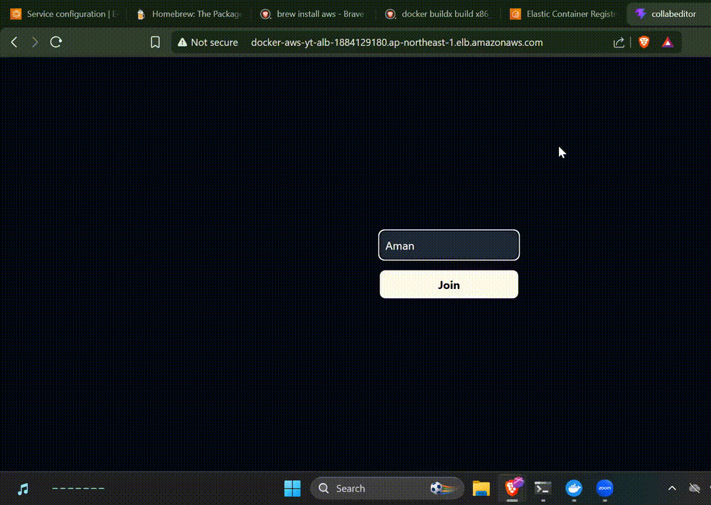

# Collaborative Code Editor

A real-time collaborative code editor that enables multiple users to edit code simultaneously with instant synchronization. Built using React, Express, Socket.IO, and Yjs CRDTs, and deployed using Docker on AWS ECS Fargate.

## Demo



## Features

* Real-time collaborative code editing
* Multi-user live synchronization
* Conflict-free editing using Yjs CRDTs
* Monaco Editor integration
* WebSocket communication using Socket.IO
* Responsive and modern UI
* Dockerized application with multi-stage builds
* Cloud deployment using AWS ECS and Amazon ECR
* Scalable container-based architecture

## Architecture

```text
Users
  │
  ▼
AWS Application Load Balancer
  │
  ▼
AWS ECS Fargate
  │
  ▼
Docker Container
  │
  ├── React Frontend
  ├── Express Backend
  ├── Socket.IO Server
  └── Yjs Collaboration Engine
```

## Tech Stack

### Frontend

* React
* TypeScript
* Monaco Editor
* Tailwind CSS (if used)

### Backend

* Express.js
* Socket.IO
* Yjs
* Bun / Node.js

### DevOps & Cloud

* Docker
* Amazon ECS
* Amazon ECR
* AWS IAM
* AWS Application Load Balancer

## How It Works

1. Users join the same collaborative room.
2. Edits are propagated through Socket.IO.
3. Yjs CRDTs ensure conflict-free synchronization.
4. All connected clients receive updates in real time.
5. Changes remain consistent across all participants.

## Docker Deployment

Build the Docker image:

```bash
docker build -t collab-editor .
```

Run the container:

```bash
docker run -p 3000:3000 collab-editor
```

## AWS Deployment

The application was deployed using:

* Amazon ECR for container image storage
* Amazon ECS Fargate for container orchestration
* AWS IAM for permission management
* Application Load Balancer for traffic routing

Deployment workflow:

```text
Local Development
        │
        ▼
Docker Image
        │
        ▼
Amazon ECR
        │
        ▼
Amazon ECS Fargate
        │
        ▼
Application Load Balancer
        │
        ▼
Users
```

## Installation
 
Clone the repository:

```bash
git clone <repository-url>
cd CollabEditor
```

Install dependencies:

```bash
# Frontend
cd Frontend
bun install

# Backend
cd ../Backend
bun install
```

Run locally:

```bash
# Backend
bun run dev

# Frontend
bun run dev
```

## Key Learnings

* Building real-time collaborative applications
* Implementing CRDTs using Yjs
* WebSocket communication with Socket.IO
* Docker containerization and multi-stage builds
* AWS ECS and ECR deployment workflow
* IAM role and permission management
* Cloud infrastructure troubleshooting

## Future Improvements

* User authentication
* Presence indicators and cursors
* Shared terminals
* Code execution support
* Persistent document storage
* Room management and sharing

## Author

Abhishek Bose

Built to explore real-time systems, cloud deployment, and collaborative application architecture.
